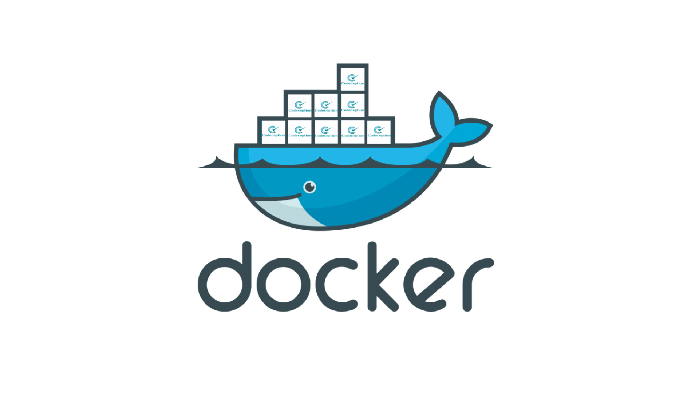

# Docker for beginners



## Learn to build and deploy your distributed applications easily to the cloud with Docker

## Written by Kerry Zhou (A fourth-year CS student from Shanghai)

---

## Introduction

### What is Docker?

Wikipedia defines [Docker](https://www.docker.com) as

> an opens-source project that automates the deployment of software applications inside **containers** by providing an additinal layer of abstraction and automation of **OS-level virtualization** on Linux

Awesome! 👍 That's a mouthful. In simple words, Docker is a tool that allows developers to easily deploy their applications in a sandbox(called containers) to run on the ost operating system i.e. Linux. The key benefit of Docker is that it allows users to package an application with all of its dependencies into a standardized unit for software development.

### What are containers?

Containers offer a logical packaging mechanism in which applications can be abstracted from the environment in which they actually run. This decoupling allows container-based applications to be deployed easily and consistently, regardless of whether the target environment is a private data center, the public cloud, or even a developer's personal local machine. This gives developers the ability to create predictable environments that are isolated from the rest of the applications and can be run anywhere.

From an operations standpoint, apart from portability containers also give more granular control over resources giving your infrastructure improved efficiency which can result in better utilization of your compute resources.

### Terminology

Before we go further, let me clarify some Docker-specific jargon that is used frequently in the Docker System.

- Image: The blueprints of our applications which form the basis of containers.
- Container: Created from Docker images and run the actual application.
- Docker Daemon: The background service running on the host that manages building, running and distributing Docker containers. The daemon is the process that runs in the operating system which clients talk to.
- Docker Client: The command line tool that allows the user to interact with the daemon.
- Docker Hub: A [registry](https://hub.docker.com/search?q=&type=image) of Docker images. You can think of all available Docker images. If required, one can host their own Docker registries can use them for pulling images.

### What will this tutorial be teaching?

This tutorial aims to be the one-stop shop for getting your hands dirty with Docker. Apart from demystifying the Docker landscape, it'll give you hands-on experience with building and deploying your own web apps on the Cloud. We'll be using Amazon Web Services to deploy a static website, and two dynamic webapps on EC2 using Elastic Beanstalk and Elastic Container Service. Even if you have no prior experience with deployments, this tutorial should be all you need to get started. Let's get started!!!! 🏃

----

## GETTING STARTED

### Prerequisites

There are no specific skills needed for this tutorial beyond a basic comfort with the command line and using a text editor. This tutorial uses `git clone` to clone the repository locally. If you don't have Git installed on your system, either install it or remember to manually download the zip files from Github. Prior experience in developing web applications will be helpful but is not required. As we proceed further along the tutorial, we'll make use of a few cloud services. If you're interested in following along, please create an account on each of these websites:

- [Amazon Web Services](http://aws.amazon.com)
- [Docker Hub](https://hub.docker.com)

### Setting up your computer

The getting started guide on Docker has detailed instructions for setting up Docker on Mac, Linux and Windows.

Once you are done installing Docker, test your Docker installation by running the following:


```bash
$ docker run hello-world

Hello from Docker.
This message shows your installation appears to be working correctly

```